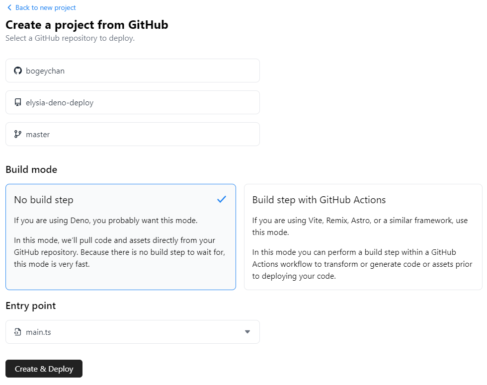

# elysia-deno-deploy

This project was scaffolded by [create-elysia](https://github.com/bogeychan/create-elysia) with Deno:

```bash
deno run -r=npm:create-elysia --allow-read --allow-write npm:create-elysia
```

# Setup

Follow these steps to run [Elysia.js](https://elysiajs.com) under [Deno](https://deno.land):

1. You're ready to go. Checkout the deno tasks inside [deno.jsonc](./deno.jsonc)!
   ```bash
   deno task start
   ```

# Deployment

To deploy a new project visit your [Deno Projects - Dashboard](https://dash.deno.com/projects)

1. Fork this repository
2. Create a project from GitHub

   

3. Create & Deploy
